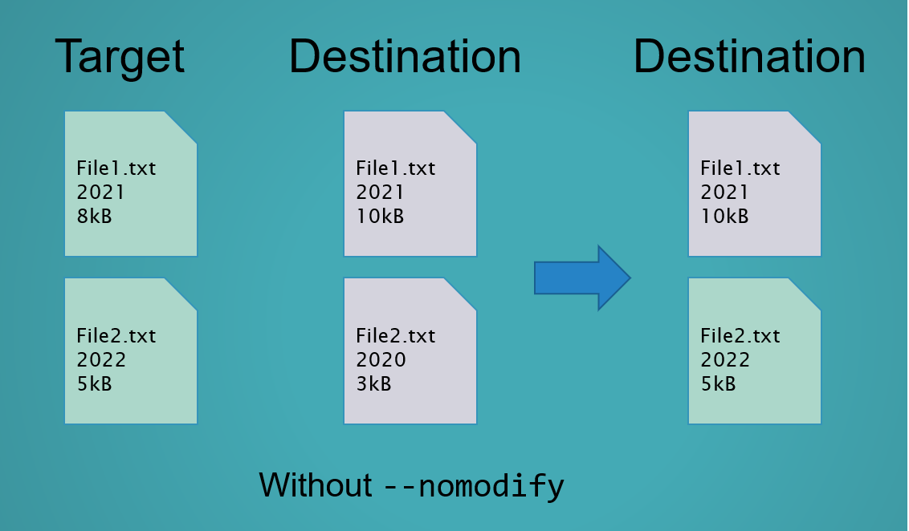
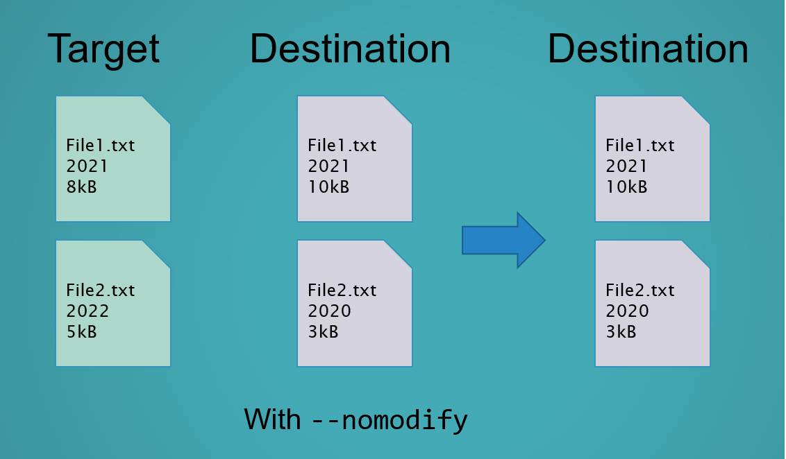
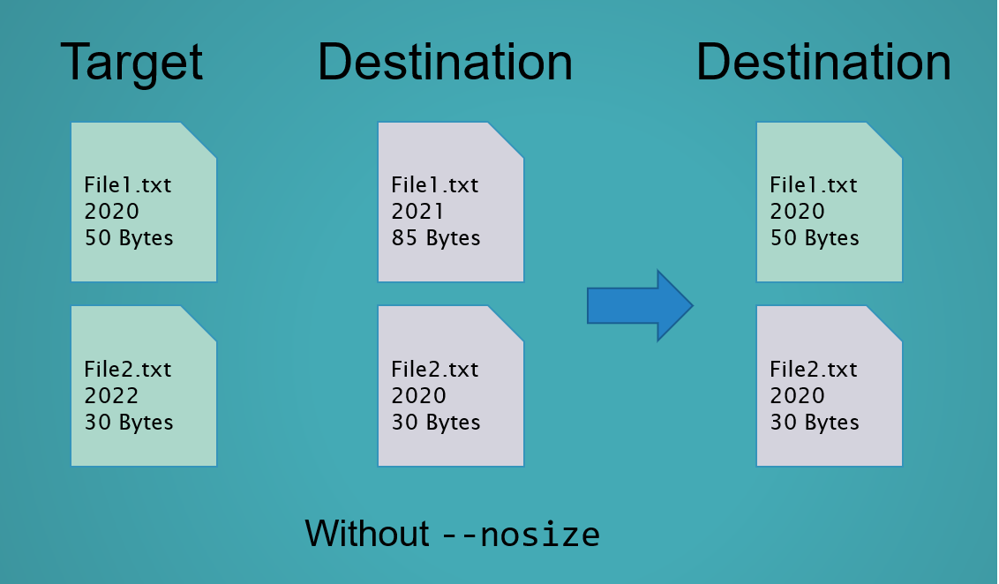
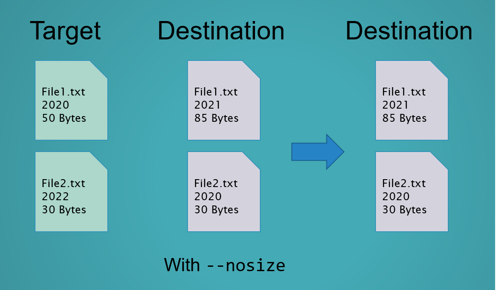
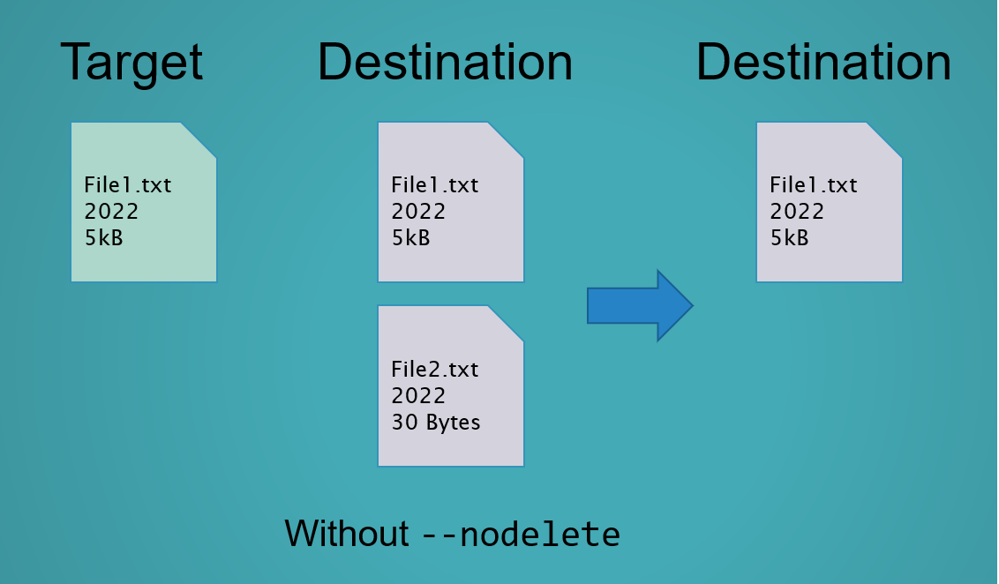
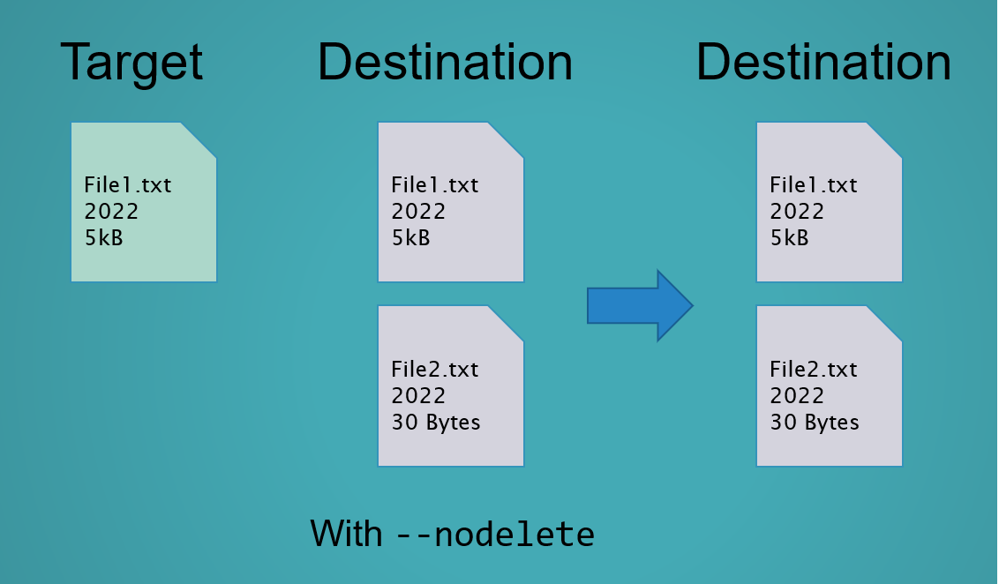

# Mirror Update Backup
Backup a folder to an another folder by using mirror update method.

# How to use
## Install requirement
    pip install -r requirements.txt
## Using argument
      -h, --help       show this help message and exit.
      -i, --input      Target folder.
      -o, --output     Destination folder.
      -p, --progress   Show progress rather then verbose.
      -nm, --nomodify  Do not compare for file modification date.
      -ns, --nosize    Do not compare for file size.
      -nd, --nodelete  Do not delete files and folders that ONLY exist on the destination.
      -nf, --nofail    Ignore fail and keep the thing running.
### Examples :
      MirrorUpdate.py -i "Folder to backup" -o "Backup folder"
      MirrorUpdate.py -i "Folder to backup" -o "Backup folder" -p
      MirrorUpdate.py -i "Folder to backup" -o "Backup folder" -p -nm
      MirrorUpdate.py -i "Folder to backup" -o "Backup folder" -p -nm -nf
      MirrorUpdate.py --input "Folder to backup" --output "Backup folder" --progress
# How it's work
Mirror target folder to destination folder:
1. Copy/Replace from target folder to destination folder recursively.
2. Copy/Replace job is determine by modify date and file size.
3. Delete all files and folders that only available on destination folder.
4. As the result, the target content will be as same as the destination content by modify date and file size.
## --nomodify:
File modification date will be compared

File modification date will not being compared

## --nosize:
File size will be compared

File size will not being compared

## --nodelete:
Files and folders will be deleted to mirroring the target folder

Files and folders will not be deleted

